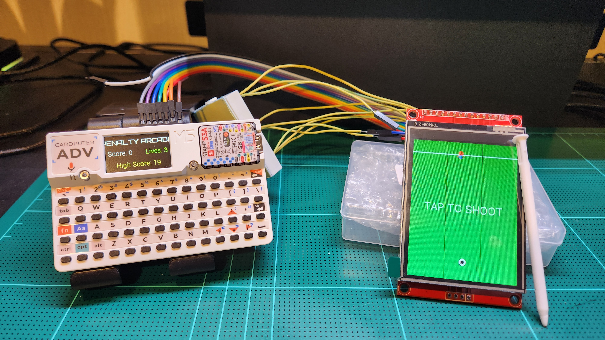

# Cardputer Penalty Arcade

An 8-bit retro football penalty shootout arcade game developed for the **M5Stack Cardputer (ESP32-S3)**. Built with C++, Arduino framework, and PlatformIO.

🎥 **[Watch the Gameplay Video here](https://youtu.be/b3nU21ZUHPo)**

📖 **[View the complete LCD Wiring Guide here](https://github.com/Nitkz/m5cardputer-st7789-touch)**

## 🌟 Features

- **Dual-Screen Architecture**: 
  - **Main Game Field**: An external custom ST7789 display dedicated exclusively to the high-speed penalty kick gameplay (no UI clutter).
  - **Digital Scoreboard**: The Cardputer's built-in internal display acts as an interactive scoreboard displaying Score, Lives, and High Score in real-time.
- **Touch Controls**: Utilizes an **XPT2046 touch controller**. Tap the external screen in one of three lanes (Left, Center, Right) to aim and shoot!
- **Endless Arcade Mode**: 
  - Start with **3 Lives**.
  - Scoring goals increases the difficulty dynamically (faster ball speed and faster goalkeeper).
  - Missing a shot (goalkeeper saves) deducts a life and slightly slows the goalkeeper down to give you a chance to recover.
- **Dynamic 3D Visuals**: The ball dynamically shrinks as it travels towards the goal to simulate 3D depth and perspective.
- **Persistent High Scores**: High scores are automatically saved to the ESP32's non-volatile storage (NVS) via the `Preferences` library and persist across reboots.
- **Sound Effects**: Audio feedback for shooting, scoring, and saving utilizing the Cardputer's internal speaker via `M5Unified`.

## 🛠 Hardware Requirements

- **M5Stack Cardputer** (ESP32-S3)
- **External ST7789 SPI Display** (with XPT2046 Touch Controller)
- **Wiring (SPI2_HOST):**
  - Displays and touch controllers share the SPI bus. Be mindful of physical pin conflicts (e.g., SD Card).

## 🚀 Getting Started

1. Clone this repository.
2. Open the project in **VSCode** with the **PlatformIO** extension.
3. Connect your Cardputer and build/upload the `m5stack-cardputer-advanced` environment.
4. Tap the external screen to shoot!

## 🔧 Built With
- [M5Unified](https://github.com/m5stack/M5Unified) - Hardware abstraction for Cardputer
- [M5GFX](https://github.com/m5stack/M5GFX) - Graphics rendering for dual displays
- [Arduino `Preferences`](https://espressif-docs.readthedocs-hosted.com/projects/arduino-esp32/en/latest/api/preferences.html) - NVS Storage for High Scores
- [Jules](https://jules.google) - AI Assistant for writing and developing the project